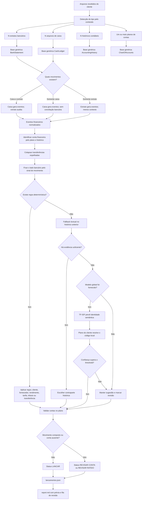
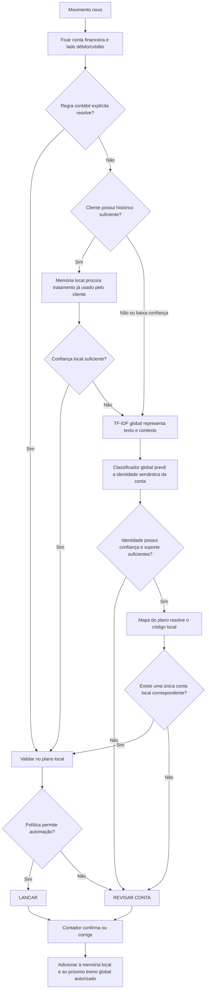

# Guia do motor contábil determinístico

Este é o documento de continuidade do processo que transforma extratos bancários e/ou controles de caixa em sugestões de lançamentos contábeis. Ele deve ser lido primeiro ao abrir uma nova sessão para continuar o trabalho, testar novos clientes ou melhorar as regras.

## Objetivo

Gerar lançamentos com débito, crédito, valor, complemento, confiança e status de revisão sem depender de LLM ou modelo neural. O núcleo permanece determinístico e pode usar um fallback estatístico TF-IDF versionado. O sistema usa:

- importadores determinísticos;
- conciliação por conta, data e valor;
- regras contábeis explícitas;
- repetição de padrões do histórico do próprio cliente;
- fallback global treinado com históricos autorizados de outros clientes;
- validação contra o plano de contas;
- fila de revisão quando a evidência não é suficiente.

O sistema não deve inventar contas nem decompor um pagamento agregado sem memória de cálculo.

## Estado atual

Implementação principal:

- `src/lume_ingestion/accounting_entries.py`: base genérica, motor, fallback histórico e execução do ciclo;
- `src/lume_ingestion/global_account_model.py`: identidade semântica, treino, avaliação, persistência e fallback TF-IDF global;
- `config/global_account_training.json`: manifesto explícito dos clientes, históricos e planos usados no treino;
- `src/lume_ingestion/models.py`: contratos normalizados;
- `src/lume_ingestion/pipeline.py`: extração, normalização e validação;
- `src/lume_ingestion/bank_statement.py`: adaptadores dos extratos PDF Itaú e Bradesco;
- `src/lume_ingestion/bank_statement_spreadsheet.py`: adaptadores do Itaú tabular XLSX e do Bradesco Net Empresa XLS;
- `src/lume_ingestion/cash_ledger.py`: importadores de caixa e preservação da conta informada na coluna `BANCO`;
- `tests/test_accounting_entries.py`: prova de que o motor funciona com banco e códigos fictícios;
- `tests/test_global_account_model.py`: prova de que a identidade semântica independe do código local;
- `tests/test_bank_statement.py`: regressão dos quatro layouts bancários atuais, incluindo origem por aba, linha e célula.

Função pública:

```python
from lume_ingestion.accounting_entries import (
    AccountingBase,
    generate_accounting_entries,
)

resultado = generate_accounting_entries(
    base,
    period="2026-08",
    fallback=None,
)
```

Quando `fallback=None`, somente regras e histórico local são usados. Pela CLI, `--global-model` carrega o artefato TF-IDF depois dessas duas camadas.

## Fluxo atual



## Contratos das quatro bases

| Base | Modelo | Informação principal | Pode haver N arquivos? |
|---|---|---|---:|
| Extrato | `BankStatement` | banco, conta, data, descrição, valor assinado e saldo | Sim |
| Caixa | `CashLedgerCollection` | conta, documento, contraparte, observação, entrada, saída e saldo | Sim |
| Histórico | `AccountingHistory` | lançamentos anteriores e pares débito/crédito | Sim |
| Plano | `ChartOfAccounts` | códigos válidos e descrições das contas | Sim |

Os nomes dos arquivos não determinam a classificação. A detecção e a normalização usam conteúdo e estrutura.

## Como os três modos funcionam

### Caixa e extrato

É o melhor cenário. O caixa é usado como fonte dos eventos porque contém documento, contraparte e observações. O extrato confirma existência, data, valor, direção e conta bancária. Um movimento não é gerado duas vezes.

### Somente caixa

O caixa gera os eventos. A conta deve estar informada na planilha, por exemplo na coluna `BANCO`. Se a conta não puder ser identificada, o motor não tenta adivinhar: deixa o lado financeiro vazio e envia a linha para revisão.

### Somente extrato

Cada transação do extrato vira um evento. Descrição e contraparte substituem os campos enriquecidos do caixa. O processo funciona, mas tende a mandar mais linhas para revisão porque o extrato normalmente não informa competência, nota fiscal ou natureza contábil suficiente.

## Ordem de classificação

Para cada evento, o motor executa esta ordem:

1. identifica a conta financeira usando a descrição do plano, o banco/conta informado e a frequência no histórico;
2. encontra e colapsa as duas faces de transferências entre contas;
3. define o lado financeiro:
   - entrada: débito na conta financeira;
   - saída: crédito na conta financeira;
4. procura uma regra semântica explícita, como rendimento, tarifa, aplicação, resgate ou tributo identificado;
5. se não houver regra, compara contraparte, documento e observações com os complementos do histórico anterior;
6. se o histórico não tiver evidência suficiente, usa um padrão conservador por direção e marca `REVISAR CONTA`;
7. valida que todo código sugerido exista no plano de contas;
8. envia pagamentos com múltiplos tributos para `REVISAR RATEIO`.

## Fallback local sem modelo

O fallback atual está em `AccountingEntryEngine._historical_fallback`. Ele:

- considera somente meses anteriores ao período processado;
- restringe candidatos pelo lado financeiro esperado;
- compara palavras normalizadas da contraparte, documento e observação com o complemento histórico;
- combina sobreposição de palavras com similaridade de sequência;
- exige pontuação mínima;
- devolve conta, confiança e justificativa auditável, por exemplo `historico_textual:0.82`.

Uma função externa pode ser injetada no argumento `fallback`. O fluxo padrão sem artefato continua determinístico; pela CLI, o artefato TF-IDF global ocupa essa posição e só é consultado quando regras e histórico local não resolvem.

## Arquitetura implementada: identidade semântica global e código local

Os clientes pertencem ao mesmo sistema contábil e geralmente usam o mesmo plano semântico, mas o número da conta pode variar. Portanto, o rótulo global não deve ser o código. Deve ser uma identidade estável derivada do texto e da posição da conta no plano, por exemplo:

```text
despesas > despesas financeiras > despesas bancarias
passivo > fornecedores > fornecedores nacionais
ativo > clientes > duplicatas a receber
```

O caminho hierárquico evita confundir descrições repetidas. Sua versão pode ser um hash do caminho normalizado, sem incluir o código local:

```text
account_semantic_key = sha256(caminho_normalizado_do_plano)
```

Cada plano recebido gera então um mapa local:

```text
account_semantic_key → código da conta naquele cliente
```

O TF-IDF global não classifica sozinho: ele transforma os dados do movimento em vetores. Um classificador linear treinado sobre esses vetores aprende a prever `account_semantic_key`. Como o motor já conhece a conta financeira e o sentido do movimento, não precisa reaprender os dois lados:

```text
saída  → crédito já é o banco; modelo prevê somente o débito
entrada → débito já é o banco; modelo prevê somente o crédito
```

Exemplo:

```text
Dados novos: "tarifa manutencao conta" + saída + origem extrato
        ↓
TF-IDF global de palavras + caracteres
        ↓
Classificador global: despesas > despesas financeiras > despesas bancarias
        ↓
Plano do cliente: esse caminho corresponde à conta 437
        ↓
Lançamento: débito 437 / crédito conta bancária identificada
```

O modelo deve classificar entre as contas conhecidas do plano. Ele não deve gerar livremente uma descrição, pois poderia inventar texto que não existe no catálogo.

### Informações aproveitadas de caixa e extrato

Mesmo sem histórico local, os arquivos de movimento fornecem features úteis:

| Informação | Uso |
|---|---|
| entrada ou saída | determina o lado bancário e contextualiza a contraparte |
| contraparte | reconhece fornecedor, cliente ou órgão recorrente |
| descrição e observação | principal evidência da natureza do movimento |
| CNPJ/CPF da contraparte | identificador forte; deve ser protegido ou tokenizado |
| tipo de transação | PIX, boleto, tarifa, TED, aplicação ou resgate |
| documento | preservar o tipo, como NF ou fatura; normalizar o número variável |
| origem caixa/extrato | informa a riqueza e confiabilidade do texto |
| conta bancária | fixa o lado financeiro; não deve ser confundida com a contrapartida |

Quando caixa e extrato existirem, a conciliação une as evidências dos dois sem criar dois eventos. Valor, dia do mês e recorrência podem ser testados depois, mas não entram na primeira versão sem prova de ganho, pois podem criar correlações frágeis.

A versão `v1` implementada usa `direção + contraparte + observação + documento`. Tipo de transação aparece quando já está escrito nesses campos. CNPJ/CPF, origem do arquivo e atributos numéricos ainda não são features estruturadas, porque os históricos atuais não possuem esses campos com cobertura equivalente para treino.

### Ordem ideal de decisão



### O que cada camada pode compartilhar

| Camada | Compartilhada entre clientes? | Resultado |
|---|---:|---|
| Normalizador e TF-IDF | Sim, com corpus autorizado | Vetor de texto e contexto |
| Classificador global | Sim | Identidade semântica da conta |
| Estrutura semântica do plano | Sim, versionada | Caminho e descrição normalizados |
| Mapa do plano do cliente | Não | Identidade semântica → código local |
| Histórico bruto e correções | Não | Memória local |
| Memória textual local | Não | Preferência contábil específica do cliente |

### Primeiro mês

Sem histórico local, o motor usa as informações do caixa/extrato, regras explícitas e o classificador global treinado com meses anteriores dos demais clientes. A identidade prevista é convertida para o código do plano recebido. Uma sugestão somente pode virar lançamento quando existir uma correspondência local única e superar o threshold validado. Os demais movimentos ficam em revisão.

### Cliente com histórico

O histórico do próprio cliente tem prioridade porque contém seu tratamento contábil real. O classificador global funciona como fallback para textos novos ou correspondências locais de baixa confiança. Inicialmente não é necessário treinar um segundo modelo por cliente: a memória textual determinística já existente cobre recorrências locais; um classificador local separado só deve ser criado se a comparação medida demonstrar ganho.

### Controles da implementação

- definir e versionar `account_semantic_key` a partir da descrição e hierarquia normalizadas;
- construir e validar o mapa `account_semantic_key → código local` de cada cliente;
- treinar apenas linhas cuja conta de contrapartida possua identidade semântica válida;
- transformar cada lançamento financeiro em `texto + contexto conhecido → account_semantic_key`;
- medir `leave-one-client-out`: treinar sem um cliente e testar integralmente nele;
- manter também validação temporal: nenhum mês futuro participa do treino;
- calibrar confiança, cobertura e suporte por conta;
- exigir suporte de mais de um cliente para automatização global;
- manter origem, versão, motivo e confiança em cada sugestão;
- compartilhar dados somente quando houver autorização e política de anonimização.

O protótipo histórico permanece em `scripts/experiment_account_pair_classifier.py`. A implementação vigente está em `src/lume_ingestion/global_account_model.py`: ela prevê a identidade semântica da contrapartida, acrescenta a direção, mede `leave-one-client-out`, usa corte temporal e impede que um modelo treinado depois do período seja aplicado retroativamente.

## Proteção contra vazamento do golden

Uma planilha final do mesmo mês pode estar na pasta para medição. Ela é importada como histórico, mas o motor exclui automaticamente qualquer lançamento com mês igual ou posterior ao período processado.

Exemplo: ao processar `2026-08`, somente lançamentos anteriores a agosto participam do fallback. O arquivo final de agosto pode ser usado depois para comparação, nunca para classificar agosto.

## Resultado de referência: Vanguarda agosto de 2026

Entradas utilizadas:

- um controle de caixa com três contas;
- extrato Itaú;
- extrato Bradesco;
- histórico de janeiro a julho;
- plano de contas;
- golden de agosto somente para avaliação posterior.

Resultado atual:

| Métrica | Resultado |
|---|---:|
| Movimentos de caixa | 255 |
| Transferências espelhadas colapsadas | 12 |
| Eventos/lançamentos gerados | 243 |
| Marcados para lançamento | 203 |
| Marcados para revisão | 40 |
| Eventos diretamente comparáveis ao golden | 239 |
| Pares exatos débito/crédito | 218 |
| Acurácia nos eventos comparáveis | 91,2% |
| Precisão medida nas linhas `LANCAR` | 96,1% |
| Contas sugeridas fora do plano | 0 |

Os 243 eventos não se transformam automaticamente nas 250 linhas do golden porque três pagamentos agregados precisam ser desdobrados em onze linhas contábeis. Sem guias ou memória de cálculo, o motor preserva os três totais e pede revisão de rateio.

Saídas atuais:

- `output/generic_accounting_run/global_v1/lancamentos.json`;
- `output/generic_accounting_run/global_v1/report.md`;
- `output/global_account_model/2026-08/model.pkl`;
- `output/global_account_model/2026-08/metadata.json`;
- `output/global_account_model/2026-08/evaluation.json`;
- `output/global_account_model/2026-08/report.md`.

### Resultado do fallback global disponível

O artefato `global-account-v1-6c7d7703f000` foi treinado com 5.635 lançamentos financeiros anteriores a agosto, três clientes e 96 identidades semânticas.

| Avaliação | Resultado |
|---|---:|
| Validação temporal de julho | 94,6% top-1; 97,3% top-3 |
| Cliente Luftklim fora do treino | 77,6% top-1 |
| Cliente Martine fora do treino | 86,8% top-1 |
| Cliente Vanguarda fora do treino | 87,0% top-1 |
| Threshold para precisão-alvo de 99% | 0,9993429 |
| Cobertura no teste cross-client nesse threshold | 32,2% |
| Precisão observada nas linhas aceitas | 99,7% |
| Golden Vanguarda agosto, fora do treino | 85,0% top-1; 96,8% top-3 |
| Automação no golden de agosto | 6/253 linhas; 100% corretas |

Esses resultados são baseline local, não promessa para clientes futuros. O threshold conservador mantém previsões abaixo dele como sugestão para revisão.

## Treinar e testar o fallback global

O manifesto [global_account_training.json](../config/global_account_training.json) associa explicitamente cliente, histórico e plano. Para gerar um artefato sem usar agosto:

```powershell
poetry run python -m lume_ingestion.global_account_model train `
  config/global_account_training.json `
  --before-period 2026-08 `
  --output output/global_account_model/2026-08
```

Para avaliar um arquivo final que não participou do treino:

```powershell
poetry run python -m lume_ingestion.global_account_model test `
  output/global_account_model/2026-08 `
  "docs/Clientes/NOVO_CLIENTE/lancamentos_finais.xlsx" `
  "docs/Clientes/NOVO_CLIENTE/plano_de_contas.xlsx" `
  --period 2026-08 `
  --output output/global_account_model/tests/NOVO_CLIENTE-2026-08
```

Nunca incluir o cliente usado como teste no manifesto do artefato que será avaliado, salvo seus períodos estritamente anteriores quando a intenção for medir evolução temporal e não cliente novo.

## Comando para executar um novo ciclo

```powershell
poetry run python -m lume_ingestion.accounting_entries `
  "docs/NOVO_CLIENTE" `
  "docs/NOVO_CLIENTE/plano_de_contas.xlsx" `
  --period 2026-09 `
  --global-model "output/global_account_model/2026-08" `
  --output "output/NOVO_CLIENTE/2026-09"
```

O comando percorre recursivamente as pastas, importa os arquivos reconhecidos, popula as quatro bases e executa o motor.

Para verificar apenas a lógica mínima:

```powershell
poetry run python -m lume_ingestion.global_account_model self-check
poetry run python -m lume_ingestion.accounting_entries ignorado --period 2026-09 --self-check
poetry run pytest tests/test_accounting_entries.py tests/test_global_account_model.py -q
```

## Como adicionar outro cliente

1. criar uma pasta para o lote do cliente;
2. incluir caixa e/ou extratos;
3. incluir histórico contábil anterior, quando disponível;
4. incluir o plano de contas do próprio cliente;
5. informar o período que será processado;
6. executar o ciclo;
7. revisar `report.md` e as linhas de `review` em `lancamentos.json`;
8. quando houver um arquivo final revisado pelo contador, medir o resultado contra ele;
9. para teste de cliente novo, não adicionar esse cliente ao manifesto de treino;
10. depois da avaliação, adicionar seu histórico e plano ao manifesto para a próxima versão global;
11. transformar erros recorrentes em regra genérica ou evidência histórica melhor;
12. criar um teste que não dependa do nome do cliente nem de códigos fixos.

Não adicionar ao motor uma regra como “se cliente Vanguarda, usar conta X”. A regra deve representar um conceito contábil ou ser fornecida como configuração externa do cliente.

## Como adicionar outro banco

O motor não interpreta documentos brutos diretamente. Cada layout bancário precisa de um adaptador que converta o documento para `BankStatement`.

Ao adicionar um banco:

1. reconhecer o layout pelo conteúdo impresso, não pelo nome do arquivo;
2. extrair valores assinados, datas, descrições, conta e saldos;
3. preservar origem por página ou por aba, linha e célula para auditoria;
4. reconciliar saldo inicial + movimentos = saldo final;
5. registrar o adaptador no dispatcher PDF ou tabular, conforme a fonte;
6. criar um teste com quantidade de transações e saldos esperados.

Depois disso, nenhuma alteração deve ser necessária em `AccountingEntryEngine`.

## Limitações conhecidas

- Existem adaptadores somente para quatro layouts bancários reais: Itaú PDF digital, Itaú XLSX tabular, Bradesco PDF atual e Bradesco Net Empresa XLS. Um XLS/XLSX arbitrário não é automaticamente suportado.
- Extrato sem contraparte ou documento reduz a qualidade do fallback histórico.
- O fallback global `v1` usa apenas texto combinado e direção; novas features dependem de históricos com o mesmo contrato.
- Há 993 linhas dos históricos atuais cuja conta não existe no único plano disponível para aqueles clientes; elas foram excluídas do treino. Planos específicos recuperarão parte dessa cobertura.
- Caixa sem identificação da conta é enviado para revisão quando não existe extrato correspondente.
- Pagamento agregado não pode ser dividido com segurança sem guia, folha ou memória de cálculo.
- Um mesmo fornecedor pode mudar de tratamento entre “baixa de fornecedor” e “despesa direta”; esse é um dos principais motivos de revisão.
- O código do histórico padrão não existe no histórico Vanguarda importado, portanto pode sair vazio.
- A saída atual é JSON mais relatório Markdown; ainda não há exportador XLSX do layout final.
- Arquivos abertos no Excel/OneDrive podem causar `Permission denied`; fechar o arquivo e repetir o ciclo.

## Regras para evoluir o método

- Priorizar precisão em vez de cobertura: é melhor revisar uma linha do que lançar uma conta errada.
- Nunca usar dados do mês avaliado para classificá-lo.
- Manter regras contábeis separadas de adaptadores bancários.
- Não codificar nomes de clientes, bancos ou números de conta no motor.
- Toda conta prevista deve existir no plano do cliente.
- Toda decisão deve registrar `reason`, `confidence` e linhas de origem.
- Melhorias devem ser medidas por cliente, período, cobertura automática e precisão das linhas aceitas.
- Casos impossíveis com as fontes disponíveis devem permanecer explícitos na revisão.

## Checklist para uma nova sessão

Ao retomar este trabalho:

1. ler este arquivo;
2. ler `src/lume_ingestion/accounting_entries.py`;
3. ler `src/lume_ingestion/global_account_model.py` e `config/global_account_training.json`;
4. abrir `output/global_account_model/2026-08/report.md`;
5. abrir `output/generic_accounting_run/global_v1/report.md` e `lancamentos.json`;
6. verificar se os novos arquivos estão fechados no Excel;
7. executar o novo lote com período explícito e artefato anterior ao período;
8. registrar quantidade de entradas, lançamentos, revisões, uso global e contas desconhecidas;
9. se houver golden, usar o comando `global_account_model test` sem incluí-lo no treino;
10. corrigir causas gerais, não casos isolados por nome;
11. rodar os testes direcionados e depois a suíte disponível.

## Prompt curto para colar em uma nova sessão

```text
Leia primeiro docs/GUIA-MOTOR-CONTABIL-DETERMINISTICO.md.
Continue o motor contábil híbrido usando os arquivos do novo cliente. Reaproveite
os importadores e os contratos BankStatement, CashLedger, AccountingHistory e
ChartOfAccounts. Use regras, memória local e depois o artefato TF-IDF global.
O global prevê account_semantic_key e o plano do cliente resolve o código local.
Não deixe o golden/período avaliado entrar no treino; não aplique um modelo cujo
trained_before_period seja posterior ao período; mantenha baixa confiança na
revisão; reporte top-1, top-3, cobertura, precisão e contas não mapeadas.
```
