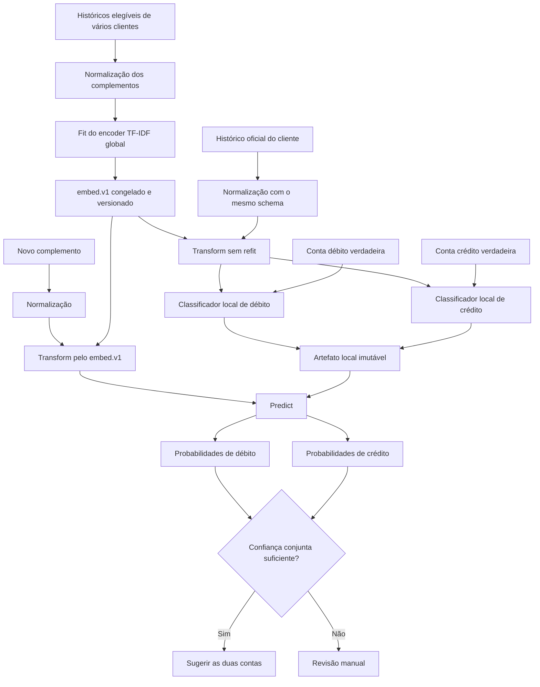

# Plano de implementação — predição de conta de débito e crédito

> **Premissa revisada e implementada:** os clientes usam, em geral, o mesmo plano semântico, mas os números das contas podem variar. A implementação vigente não usa o código como rótulo global: prevê uma identidade derivada da descrição e do caminho hierárquico, e o plano de cada cliente traduz essa identidade para o código local. A direção do movimento também entra no modelo. As seções abaixo documentam a prova de conceito anterior, baseada apenas em complemento → código. A fonte de verdade e os comandos atuais estão em `docs/GUIA-MOTOR-CONTABIL-DETERMINISTICO.md`; o código vigente está em `src/lume_ingestion/global_account_model.py`.

## 1. Objetivo

Construir uma camada assistiva que receba apenas o texto do campo `complemento` de um lançamento contábil e devolva duas sugestões independentes:

- conta contábil de débito;
- conta contábil de crédito.

Cada sugestão deve conter o código da conta, uma confiança e a versão do modelo usado. A automação deve poder se abster quando a confiança for insuficiente.

Este documento consolida a prova de conceito executada neste repositório, os resultados obtidos, as decisões tomadas durante o experimento e o plano recomendado para uma implementação em outra sessão.

## 2. Decisão final de escopo

### Entrada permitida ao modelo

Somente:

```text
complemento
```

O complemento é normalizado e convertido em uma representação vetorial TF-IDF.

### Alvos supervisionados

```text
conta_debito
conta_credito
```

Os dois códigos são respostas conhecidas durante o treinamento e não podem entrar nas features.

### Elementos que não entram nas features

- código verdadeiro da conta de débito;
- código verdadeiro da conta de crédito;
- descrição da conta;
- texto do plano de contas;
- hierarquia do plano de contas;
- valor do lançamento;
- data;
- CNPJ;
- centro de custo;
- histórico padrão.

O plano de contas pode continuar existindo fora do modelo como catálogo operacional para exibir a descrição da conta sugerida, validar se o código ainda está ativo ou permitir escolha manual. Seu texto não faz parte do classificador definido neste plano.

## 3. Terminologia correta

### Embedding global

É aceitável chamar a saída do TF-IDF de `embedding`, desde que a documentação diga explicitamente:

> embedding textual TF-IDF esparso

Não é um embedding neural ou contextual como BERT, sentence-transformers ou OpenAI Embeddings. É uma representação vetorial baseada na frequência e raridade de palavras e fragmentos de palavras.

Nome técnico sugerido:

```text
GlobalTextEncoder / embed.v1
```

### Classificador local

É o estimador treinado com o histórico de um cliente específico. Ele recebe vetores produzidos pelo encoder global e aprende a relação entre os complementos e os códigos usados por aquele cliente.

Devem existir dois estimadores locais:

```text
DebitClassifier
CreditClassifier
```

O classificador local não é o `Predict`. O `Predict` é o serviço que carrega o encoder global e os classificadores locais e executa a inferência.

## 4. Arquitetura proposta



## 5. O que foi testado

### 5.1 Fontes de dados

Históricos localizados em `docs/Historico contabil`:

- `LUFTKLIM_2026_Lctos.xlsx`;
- `MARTINE_2026_Lctos_Jan_Jul.xlsx`;
- `VANGUARD_2026_Lctos_Contimatic.xlsx`;
- `Vanguarda Consolidado_2026_Documento que o sistema deve produzir.xlsx`.

Plano localizado em `docs/Plano de conta/Plano de Contas.xlsx`.

A planilha consolidada da Vanguarda ficou bloqueada pelo Windows/OneDrive durante a medição final. Ela foi contabilizada como um arquivo inacessível e não participou das métricas.

### 5.2 Auditoria das linhas

Foram lidas 13.116 linhas das planilhas acessíveis.

| Destino | Linhas |
| --- | ---: |
| Treino, janeiro a junho de 2026 | 8.509 |
| Validação, julho de 2026 | 1.592 |
| Teste final, agosto de 2026 | 495 |
| Excluídas por M/T ou conta ausente | 2.391 |
| Excluídas por complemento ou data ausente | 129 |
| Arquivos inacessíveis | 1 |

O conjunto final utilizável teve 10.596 linhas.

O teste de agosto contém somente linhas da LUFTKLIM. Portanto, ele mede generalização temporal nesse recorte, não generalização simultânea para todos os clientes.

### 5.3 Tratamento das linhas M/T

Linhas com `M`, `T`, conta vazia ou outro valor não numérico em débito/crédito foram excluídas. Esses registros representam estruturas ou pernas de lançamentos Contimatic e não fornecem, na própria linha, um par numérico completo de débito e crédito.

Uma implementação futura só deve incluí-los depois de existir uma reconstrução determinística e testada do lançamento completo. Não se deve ensinar o modelo a prever `M` ou `T` como contas.

## 6. Normalização do complemento

A prova de conceito aplicou os seguintes passos:

1. normalização Unicode `NFKC`;
2. conversão para letras minúsculas;
3. substituição de CPF/CNPJ por `documento_fiscal`;
4. substituição de datas completas por `data`;
5. substituição de mês/ano por `competencia`;
6. substituição de valores monetários por `valor`;
7. substituição de números associados a NF, NFe, fatura ou nota por `numero`;
8. substituição de sequências numéricas com quatro ou mais dígitos por `numero`;
9. compactação de espaços.

Exemplo:

```text
Entrada:  N/Pgto de NF 12345 em 01/07/2026
Saída:    n/pgto de nf numero em data
```

O propósito é preservar a natureza contábil da frase e reduzir memorização de números variáveis, datas, documentos e valores.

O mesmo normalizador deve ser usado no treino e no Predict. Qualquer mudança cria um novo `featureSchema`.

## 7. Representação textual usada

Foram concatenadas duas matrizes TF-IDF esparsas.

### Palavras

```python
TfidfVectorizer(
    ngram_range=(1, 2),
    min_df=2,
    max_features=12_000,
    sublinear_tf=True,
)
```

Essa parte aprende palavras individuais e pares de palavras, por exemplo:

```text
pagamento
pagamento aluguel
recebimento nf
```

### Caracteres

```python
TfidfVectorizer(
    analyzer="char_wb",
    ngram_range=(3, 5),
    min_df=2,
    max_features=16_000,
    sublinear_tf=True,
)
```

Essa parte ajuda com abreviações, grafias diferentes, nomes parcialmente semelhantes e erros pequenos de digitação.

### Matriz final

```text
X = hstack(TF-IDF palavras, TF-IDF caracteres)
```

A matriz permanece em formato CSR esparso.

## 8. Classificadores utilizados

Foram treinados dois `SGDClassifier` independentes:

```python
SGDClassifier(
    loss="log_loss",
    alpha=1e-5,
    max_iter=1_000,
    tol=1e-3,
    random_state=42,
)
```

`loss="log_loss"` produz um classificador linear probabilístico equivalente à família de regressão logística, mas otimizado por gradiente estocástico. Essa escolha reduziu o tempo de treino em comparação com o `LogisticRegression(solver="lbfgs")` quando o alvo era o par conjunto.

Após incorporar treino e validação, o modelo de débito continha 221 classes e o de crédito 119 classes.

## 9. Experimentos realizados

### 9.1 Um único classificador para o par

O primeiro experimento tratou o par ordenado como uma classe única:

```text
1000006|1000029
```

Esse desenho alcançou no teste:

| Métrica | Resultado |
| --- | ---: |
| Par exato | 82,22% |
| Débito derivado do par | 84,44% |
| Crédito derivado do par | 88,28% |
| Par no top-3 | 89,49% |

O treino com `lbfgs` ficou lento porque havia centenas de combinações débito–crédito. O artefato e o custo de otimização crescem principalmente com `features × classes`, não somente com o número de linhas.

### 9.2 Dois classificadores independentes

O desenho foi alterado para:

```text
modelo 1: complemento → débito
modelo 2: complemento → crédito
```

Isso reduziu o número de classes por estimador e melhorou o par completo.

### 9.3 Texto do plano e hierarquia

Também foi testado um score auxiliar de similaridade entre o complemento e:

- descrição folha da conta;
- caminho hierárquico da conta.

Na validação:

- débito text-only: 85,113%;
- melhor débito com plano: não superou text-only;
- crédito text-only: 90,075%;
- crédito com 20% de descrição folha: 90,138%;
- ganho de crédito: aproximadamente 0,063 ponto percentual, equivalente a uma linha em 1.592;
- hierarquia: não trouxe ganho material.

O ganho foi pequeno demais para justificar a complexidade, e a decisão final foi remover descrição e hierarquia das features e do ranking.

## 10. Resultado final text-only

As métricas abaixo foram recalculadas depois da decisão de utilizar somente o complemento.

### Validação — julho de 2026

| Métrica | Débito | Crédito |
| --- | ---: | ---: |
| Acurácia | 85,11% | 90,08% |
| Macro F1 | 54,86% | 58,62% |
| Top-3 | 96,11% | 99,12% |
| Classe já vista no treino | 99,62% | 99,56% |

As duas contas ficaram corretas na mesma linha em 78,08% da validação.

### Teste temporal intocado — agosto de 2026

| Métrica | Débito | Crédito |
| --- | ---: | ---: |
| Acurácia | **86,46%** | **90,30%** |
| Macro F1 | 63,37% | 69,34% |
| Top-3 | 91,72% | 98,99% |
| Classe já vista no treino | 99,80% | 99,80% |
| Confiança média | 77,88% | 86,85% |

Resultado conjunto:

| Métrica | Resultado |
| --- | ---: |
| Débito e crédito corretos na mesma linha | **83,43%** |
| Macro F1 do par produzido | 50,89% |

O Macro F1 inferior à acurácia mostra forte desbalanceamento: contas frequentes são previstas muito melhor que contas raras. A acurácia agregada não deve ser a única condição para produção.

## 11. Política de confiança medida

A confiança conjunta foi definida como:

```text
min(confiança_débito, confiança_crédito)
```

Os thresholds foram escolhidos somente na validação de julho e aplicados sem ajuste ao teste de agosto.

| Precisão desejada na validação | Threshold | Cobertura no teste | Precisão observada no teste | Linhas aceitas |
| ---: | ---: | ---: | ---: | ---: |
| 90,0% | 0,5910 | 80,61% | 92,98% | 399 |
| 95,0% | 0,8170 | 55,35% | 97,45% | 274 |
| 99,5% | 0,9572 | 11,11% | 100,00% | 55 |

Esses números demonstram que o modelo é mais útil como sistema de sugestão com abstenção do que como classificador obrigatório de todas as linhas.

O threshold de produção não deve ser copiado cegamente. Ele precisa ser recalibrado por cliente e por revisão do modelo, com suporte mínimo de observações aceitas.

## 12. Limitações da prova de conceito

1. O encoder e os dois classificadores da prova de conceito foram treinados com dados dos clientes reunidos. Ainda não foi medida a qualidade de classificadores locais isolados por cliente.
2. O teste de agosto possui somente 495 linhas da LUFTKLIM.
3. A planilha consolidada da Vanguarda não entrou no teste porque estava bloqueada.
4. Linhas Contimatic M/T foram excluídas.
5. O modelo não consegue prever uma conta que nunca apareceu entre seus rótulos de treino.
6. As probabilidades do `SGDClassifier` não foram calibradas com `CalibratedClassifierCV`.
7. Não foi feita análise detalhada por classe, suporte mínimo, matriz de confusão ou custo contábil do erro.
8. Não foi testado isolamento cross-client: treinar em um cliente e avaliar em outro completamente excluído.
9. Não foi medido drift entre exercícios fiscais ou anos diferentes.
10. O conjunto de dados contém informações privadas e deve continuar local.

O resultado de 83,43% não deve ser apresentado como precisão esperada para qualquer cliente. Ele é a capacidade observada no recorte temporal disponível.

## 13. Arquitetura recomendada para produção

### 13.1 Encoder global congelado

Treinar uma única vez o TF-IDF word + char usando complementos elegíveis de um corpus autorizado. Publicar como artefato imutável contendo:

```text
embeddingVersion
featureSchema
normalizationVersion
wordVectorizer
charVectorizer
corpusSha256
runtimeVersions
```

Os classificadores locais devem chamar apenas `transform()`. Eles não devem refazer `fit()` no encoder.

### 13.2 Dois classificadores locais por cliente

Para cada `(tenantId, clientId, historyRevision, embeddingVersion)`:

```text
debitClassifier
creditClassifier
debitClasses
creditClasses
debitThreshold
creditThreshold
jointThreshold ou política conjunta
evaluation
snapshotSha256
modelVersion
```

Os códigos das contas continuam como labels. Descrições e hierarquia não entram no fit.

### 13.3 Predict

Responsabilidades:

1. autenticar a chamada;
2. validar tenant e cliente;
3. validar `embeddingVersion`, `featureSchema`, `historyRevision` e `modelVersion`;
4. normalizar o complemento;
5. transformar pelo encoder global congelado;
6. obter `predict_proba()` para débito;
7. obter `predict_proba()` para crédito;
8. calcular a confiança conjunta;
9. devolver sugestão ou abstenção;
10. não treinar, não atualizar IDF e não acessar o banco diretamente.

Contrato sugerido:

```json
{
  "requestId": "uuid",
  "tenantId": "uuid",
  "clientId": "uuid",
  "context": {
    "historyRevision": 7,
    "embeddingVersion": "embed.v1-<sha>",
    "modelVersion": "account-pair-r7-<sha>",
    "featureSchema": "account-pair-text.v1"
  },
  "rows": [
    {
      "rowId": "linha-123",
      "complement": "N/Pgto de aluguel agosto"
    }
  ]
}
```

Resposta sugerida:

```json
{
  "modelVersion": "account-pair-r7-<sha>",
  "rows": [
    {
      "rowId": "linha-123",
      "debitAccount": "4000053",
      "debitConfidence": 0.94,
      "creditAccount": "1000006",
      "creditConfidence": 0.98,
      "jointConfidence": 0.94,
      "status": "suggested"
    }
  ]
}
```

Quando a confiança não atingir a política:

```json
{
  "rowId": "linha-123",
  "status": "review",
  "reasonCode": "LOW_CONFIDENCE"
}
```

## 14. Treinamento e retraining

### Estratégia inicial recomendada

Usar retraining completo dos dois classificadores locais sempre que uma nova revisão oficial do histórico for confirmada.

O fluxo deve ser:

```text
histórico confirmado
→ incrementa historyRevision
→ snapshot imutável das linhas elegíveis
→ transform pelo embed global
→ treino dos dois classificadores locais
→ validação temporal
→ cálculo dos thresholds
→ serialização e SHA-256
→ publicação
→ ativação somente se a revisão ainda for atual
```

Não implementar `partial_fit` inicialmente. O custo principal depende do número de classes e features; para os volumes atuais, o retrain completo é mais simples, reproduzível e auditável.

### Quando atualizar o embedding global

Não atualizar a cada novo mês ou correção local. Recriar o encoder global apenas quando houver evidência de:

- vocabulário fora do encoder aumentando;
- queda consistente de desempenho em vários clientes;
- mudança relevante na normalização;
- novo idioma, sistema ou padrão textual;
- aumento planejado dos limites de features.

Uma nova versão global exige retreinar os classificadores locais, pois os coeficientes dependem das dimensões e da ordem das features.

### Treino incremental futuro

`SGDClassifier` aceita `partial_fit`, mas o `TfidfVectorizer` tradicional não atualiza o IDF incrementalmente. Uma alternativa futura seria `HashingVectorizer`, que possui espaço fixo, mas ela perde vocabulário inspecionável e adiciona colisões. Só adotar quando o retrain completo se tornar um gargalo medido.

## 15. Critérios mínimos para treinar um cliente

Definir e testar antes da implementação. Sugestão inicial:

- ao menos três meses distintos;
- ao menos 100 linhas de treino;
- ao menos duas contas de débito e duas de crédito;
- validação e teste temporais não vazios;
- suporte mínimo por conta para automação;
- nenhum dado de outro tenant/cliente no snapshot local;
- classes previstas pertencentes ao catálogo ativo do cliente;
- modelo sem threshold suportado permanece assistivo ou indisponível, nunca automático.

Se o cliente não tiver dados suficientes, responder `INSUFFICIENT_DATA` e manter revisão manual.

## 16. Protocolo obrigatório de avaliação

### Split temporal

Nunca fazer split aleatório como avaliação principal. O padrão deve ser:

```text
meses antigos → treino
penúltimo mês → validação e threshold
último mês → teste final intocado
```

### Métricas

Registrar no mínimo:

- acurácia de débito;
- macro F1 de débito;
- top-3 de débito;
- acurácia de crédito;
- macro F1 de crédito;
- top-3 de crédito;
- acurácia exata das duas contas;
- cobertura e precisão após threshold;
- taxa de contas não vistas no treino;
- métricas por conta e faixa de suporte;
- métricas por cliente;
- matriz de confusão das classes mais frequentes;
- volume de abstenções.

### Avaliações adicionais antes de produção

1. walk-forward em mais de uma fronteira mensal;
2. leave-one-client-out para medir transferência e vazamento cross-client;
3. modelo local por cliente comparado ao modelo pooled da prova de conceito;
4. desempenho em complementos normalizados nunca vistos;
5. desempenho por conta rara;
6. estabilidade dos thresholds;
7. tempo e memória de treino e inferência;
8. auditoria manual de uma amostra de erros de alto risco.

## 17. Segurança contra leakage

Regras obrigatórias:

- TF-IDF global deve ser fitado somente no corpus permitido para aquela versão;
- teste temporal nunca participa do fit do encoder usado para medir a prova;
- débito e crédito verdadeiros nunca entram em `X`;
- descrição e hierarquia das respostas não entram em `X`;
- normalizadores e thresholds são ajustados antes do teste;
- duplicatas entre treino e teste devem ser identificadas e reportadas;
- snapshots locais devem validar `(tenantId, clientId)` em todas as linhas;
- métricas finais não podem ser usadas para escolher hiperparâmetros.

## 18. Tamanho e escalabilidade

O número de linhas aumenta principalmente o tempo de treino. O tamanho serializado dos classificadores depende aproximadamente de:

```text
número de features × número de classes de débito
+
número de features × número de classes de crédito
```

O modelo não precisa armazenar todas as linhas após o treino. Isso o torna mais previsível que uma memória kNN que cresce linearmente com cada lançamento armazenado.

Controles iniciais:

- manter matrizes CSR;
- limitar features de palavra e caractere;
- dois modelos separados em vez de uma classe para cada par;
- registrar duração e pico de memória;
- manter encoder em cache no Predict;
- carregar artefatos locais sob demanda com cache LRU limitado;
- usar batch de inferência;
- não criar modelo hierárquico até existir gargalo ou ganho medido.

## 19. Dependências

A prova utilizou:

```text
Python 3.12
openpyxl 3.1.5
numpy 1.26.4
pandas 2.3.3
scipy 1.17.1
scikit-learn 1.8.0
```

O `pyproject.toml` atual já declara `openpyxl`, mas ainda não declara numpy, pandas, scipy, scikit-learn ou joblib para esta funcionalidade. A implementação deve decidir se o modelo ficará neste projeto ou em um serviço isolado antes de alterar dependências.

## 20. Artefatos da prova de conceito

- Código executado: `scripts/experiment_account_pair_classifier.py`.
- Relatório resumido anterior: `output/account_pair_classifier/report.md`.
- Métricas completas do experimento com comparação de plano: `output/account_pair_classifier/metrics.json`.

O script atual ainda contém os ramos experimentais de descrição e hierarquia para registrar o teste realizado. A implementação de produção deve remover esses ramos e manter apenas o caminho text-only.

## 21. Sequência mínima de implementação

1. Extrair do script o normalizador versionado e cobri-lo com testes.
2. Criar o `GlobalTextEncoder` com fit, transform, serialização e hash.
3. Criar treino local dos classificadores de débito e crédito.
4. Implementar split temporal e relatório de métricas por cliente.
5. Definir política de threshold e abstenção.
6. Criar artefato local imutável e validar compatibilidade com o encoder.
7. Implementar o Predict síncrono.
8. Implementar Trainer assíncrono e ativação condicionada à `historyRevision`.
9. Rodar walk-forward e comparação pooled versus local.
10. Só promover quando os critérios de precisão, cobertura, isolamento e auditoria forem satisfeitos.

## 22. Critérios de aceite sugeridos

- a requisição de Predict contém somente `rowId` e `complement` por linha;
- o modelo não lê valor, data, CNPJ, HIST, descrição ou hierarquia de conta;
- encoder e classificadores possuem versões e hashes verificáveis;
- um artefato local nunca atende outro cliente;
- revisão antiga nunca volta a ser ativa;
- resultados são reproduzíveis com `random_state=42` e versões fixadas;
- falha de modelo não apaga resultados determinísticos anteriores;
- abaixo do threshold, a linha vai para revisão;
- todas as métricas são calculadas em dados temporalmente posteriores ao treino;
- nenhuma alegação de qualidade usa a planilha consolidada bloqueada sem uma nova execução.

## 23. Decisões explícitas para a próxima sessão

Implementar:

```text
complemento
→ normalização versionada
→ TF-IDF global congelado
→ classificador local de débito
→ classificador local de crédito
→ threshold conjunto
→ sugestão ou revisão
```

Não implementar nesta primeira versão:

- texto do plano como feature;
- hierarquia contábil como feature;
- classificador de pares combinados;
- embedding neural;
- kNN sobre todas as linhas;
- `partial_fit`;
- modelo hierárquico;
- predição de estruturas M/T;
- retentativa automática de Predict.

Esses itens só devem voltar ao escopo se uma medição futura demonstrar ganho ou necessidade operacional.
